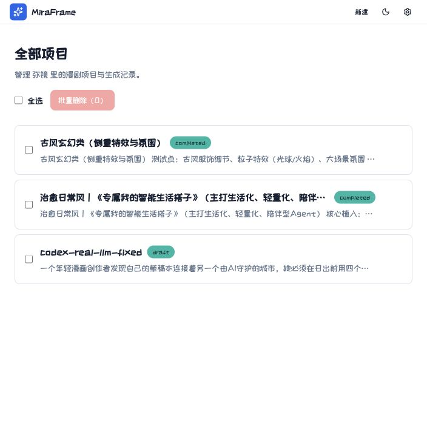
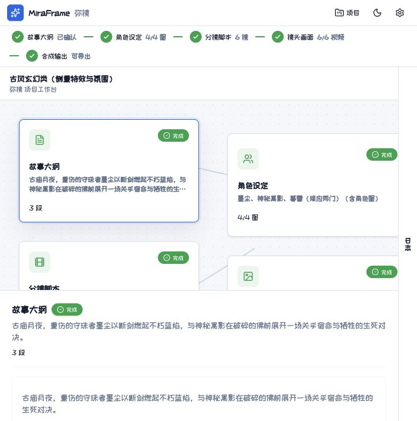
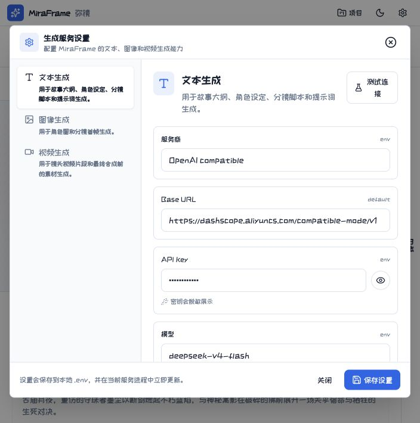

# MiraFrame 弥镜

<div align="center">
  <p><strong>一个全 TypeScript 的 AI 漫剧生成项目</strong></p>
  <p>从故事想法出发，用 LangGraph.js 编排多 Agent，生成故事大纲、角色设定、分镜脚本、角色图与镜头素材。</p>

  <p>
    
    
    
    
    
    
  </p>
</div>

MiraFrame 是一个面向 AI 漫剧创作的全栈 Agent 项目。它不是简单调用一次大模型，而是把“故事大纲 → 角色设定 → 分镜脚本 → 角色图 → 镜头素材 → 导出”拆成可观察、可重试、可人工反馈的创作流水线。

这个项目特别适合正在从前端转向 AI Agent / AI 应用工程的同学：

- 前端、后端、Agent、共享类型全部使用 TypeScript。
- 前端使用 React + Vite + Zustand + TanStack Query，学习成本贴近常见前端项目。
- 后端使用 Nest.js，把 API、WebSocket、队列、数据库和 Agent 服务拆成清晰模块。
- Agent 层使用 LangGraph.js，可以学习状态图、节点编排、人工反馈、重试和工作流恢复。
- 项目不是纯 Demo，有项目页、节点详情、设置面板、生成服务配置、失败重试等真实产品逻辑。

> [!NOTE]
> MiraFrame 目前定位为学习、演示和产品原型项目。它适合研究 AI Agent 工程化链路，不建议不经改造直接用于生产环境。

---

## 产品截图

### 项目列表



### 项目工作台



### 生成服务设置



---

## 你可以学到什么

如果你是前端出身，这个项目可以作为进入 AI Agent 工程的第一条完整路径：

| 学习方向 | 项目里的对应实现 |
|---|---|
| AI 产品流程 | 把漫剧创作拆成故事、角色、分镜、图片、视频、导出等阶段 |
| Agent 编排 | 使用 LangGraph.js 构建多节点状态图 |
| Human-in-the-Loop | 在故事大纲、角色设定、分镜脚本阶段支持用户反馈修改 |
| 前后端类型共享 | `@miraframe/shared` 提供 Zod Schema 和 TypeScript 类型 |
| 实时进度同步 | 后端 WebSocket 推送节点状态、日志和生成结果 |
| 失败处理 | 图片、视频、LLM 调用失败后进入失败态并支持重试 |
| 生成服务配置 | 文本、图像、视频服务可在设置面板中配置和测试 |
| 全栈工程结构 | pnpm workspace 管理 frontend / server / agent / shared |

---

## 核心功能

- 项目管理：创建、查看、批量删除漫剧项目。
- 多阶段工作流：故事大纲、角色设定、分镜脚本、镜头画面、视频与导出。
- 节点详情：在项目页查看每个节点的产物、状态和错误信息。
- 可反馈节点：故事大纲、角色设定、分镜脚本支持用户输入修改意见。
- 生成服务设置：在 UI 中配置文本、图像、视频生成服务。
- 弱提示：未配置真实生成服务时，在入口页给出轻量提醒。
- 深浅色主题：默认跟随系统主题，用户切换后保存偏好。
- Fake Provider：没有外部 API Key 时，也可以用 fake 模式跑通基础流程。

---

## 技术架构

```
MiraFrame/
├── packages/
│   ├── frontend/        # React 18 + Vite + Zustand + TanStack Query
│   ├── server/          # Nest.js API + WebSocket + Drizzle + BullMQ
│   ├── agent/           # LangGraph.js 工作流与 Agent 节点
│   └── shared/          # 共享类型、Zod Schema、常量
├── docs/screenshots/    # README 截图
├── docker-compose.yml
├── docker-compose.dev.yml
├── Dockerfile.server
├── Dockerfile.frontend
└── .env.example
```

依赖方向：

```text
frontend  ─┐
server    ─┼──> shared
agent     ─┘

server ──> agent
```

`shared` 是类型和 Schema 的单一数据源。前端拿它做类型约束，后端拿它做接口与数据校验，Agent 层也复用同一套阶段和状态定义。

---

## 工作流概览

MiraFrame 的生成流程不是一次性请求，而是一个可恢复的多阶段 Agent 图：

```text
故事输入
  ↓
故事大纲
  ↓ 用户可反馈修改
角色设定
  ↓ 用户可反馈修改
分镜脚本
  ↓ 用户可反馈修改
角色图生成
  ↓
镜头画面生成
  ↓
视频素材生成
  ↓
导出
```

当前项目中保留了典型 AI Agent 应用会遇到的产品问题：

- 什么时候让用户反馈，什么时候让系统自动推进。
- 生成失败后如何展示错误，而不是一直停留在“生成中”。
- 右侧日志和节点详情输入框如何分工，避免重复交互。
- 配置不完整时如何弱提示，而不是直接阻断用户。

---

## 技术栈

| 层级 | 技术 |
|---|---|
| 语言 | TypeScript 5.5+ |
| 包管理 | pnpm 9 workspace |
| 前端 | React 18, Vite 6, React Router 7 |
| 前端状态 | Zustand 5, TanStack Query 5 |
| UI | TailwindCSS 4, Radix UI, lucide-react |
| 后端 | Nest.js 11 |
| Agent 编排 | LangGraph.js v1.x |
| 数据库 | PostgreSQL 16 |
| ORM | Drizzle ORM, drizzle-zod |
| 队列 / 缓存 | Redis 7, BullMQ |
| 实时通信 | Socket.IO |
| 测试 | Vitest, Testing Library, Playwright |
| 部署 | Docker Compose |

---

## 快速开始

### 1. 准备环境

需要安装：

- Node.js >= 22
- pnpm >= 9
- Docker Desktop，或本地 PostgreSQL + Redis

启用 pnpm：

```bash
corepack enable
corepack prepare pnpm@9.12.0 --activate
```

### 2. 启动数据库和 Redis

开发环境可以只用 Docker 启动基础设施：

```bash
docker compose -f docker-compose.dev.yml up -d
```

默认会启动：

- PostgreSQL: `localhost:5432`
- Redis: `localhost:6379`
- 数据库名: `miraframe`

### 3. 配置环境变量

```bash
cp .env.example .env
```

默认 `.env.example` 使用 fake provider，可以先不填真实 API Key：

```env
TEXT_PROVIDER=fake
IMAGE_PROVIDER=fake
VIDEO_PROVIDER=fake
```

如果要接入真实生成服务，可以改成：

```env
TEXT_PROVIDER=openai
TEXT_BASE_URL=https://dashscope.aliyuncs.com/compatible-mode/v1
TEXT_API_KEY=your_text_api_key
TEXT_MODEL=deepseek-v4-flash

IMAGE_PROVIDER=openai
IMAGE_API_KEY=your_image_api_key

VIDEO_PROVIDER=openai
VIDEO_API_KEY=your_video_api_key
```

也可以启动项目后，在右上角“设置”面板中配置文本、图像和视频生成服务。

### 4. 安装依赖

```bash
pnpm install
```

### 5. 启动开发服务

后端：

```bash
pnpm --dir packages/server dev
```

前端：

```bash
pnpm --dir packages/frontend dev
```

常用访问地址：

- 前端: http://localhost:5173
- 后端 API: http://localhost:3000

---

## Docker 运行

生产式本地运行：

```bash
docker compose up -d
```

注意：项目已从 openOii 迁移为 MiraFrame。不要随意修改 Docker Compose 的 project name 或 volume 名称，否则可能会创建新的数据库卷，导致旧数据看起来“消失”。

---

## 常用命令

```bash
# 类型检查
pnpm typecheck

# 单元测试
pnpm test

# 监听测试
pnpm test:watch

# 代码检查
pnpm lint
pnpm lint:fix

# 构建全部包
pnpm build

# 数据库迁移
pnpm --dir packages/server db:generate
pnpm --dir packages/server db:migrate
```

---

## 包说明

### `@miraframe/frontend`

前端应用，负责项目列表、项目工作台、节点详情、设置面板、主题切换和实时状态展示。

重点可以学习：

- 如何用 React Query 管理服务端状态。
- 如何用 Zustand 管理局部 UI 状态。
- 如何把复杂项目页拆成 hooks、组件和 workflow 工具函数。
- 如何设计 AI 生成过程中的错误态、重试入口和用户反馈入口。

### `@miraframe/server`

Nest.js 后端，负责 REST API、WebSocket、数据库、队列、生成服务配置和 Agent 调度。

重点可以学习：

- Nest.js 模块边界如何划分。
- 如何把 Agent 服务接入传统后端。
- 如何把生成任务放入后台执行。
- 如何把 LLM、图像、视频服务抽象成可配置 provider。

### `@miraframe/agent`

LangGraph.js 工作流层，负责把创作流程拆成多个节点并维护状态。

重点可以学习：

- 状态图如何表达创作流水线。
- 节点之间如何传递上下文。
- 用户反馈如何触发局部重生成。
- 失败、重试、审批和恢复如何影响 Agent 产品体验。

### `@miraframe/shared`

共享包，放置 TypeScript 类型、Zod Schema、工作流阶段、WebSocket 事件等跨端契约。

重点可以学习：

- 如何避免前后端接口类型漂移。
- 如何让运行时校验和编译时类型共用一套 Schema。

---

## 环境变量速览

完整配置见 [`.env.example`](./.env.example)。

| 分类 | 关键变量 |
|---|---|
| 基础 | `NODE_ENV`, `PORT`, `CORS_ORIGINS`, `PUBLIC_BASE_URL` |
| 数据库 | `DATABASE_URL` |
| Redis | `REDIS_URL`, `REDIS_HOST`, `REDIS_PORT` |
| 文本生成 | `TEXT_PROVIDER`, `TEXT_BASE_URL`, `TEXT_API_KEY`, `TEXT_MODEL`, `TEXT_ENDPOINT` |
| 图像生成 | `IMAGE_PROVIDER`, `IMAGE_BASE_URL`, `IMAGE_API_KEY`, `IMAGE_MODEL`, `IMAGE_ENDPOINT` |
| 视频生成 | `VIDEO_PROVIDER`, `VIDEO_BASE_URL`, `VIDEO_API_KEY`, `VIDEO_MODEL`, `VIDEO_ENDPOINT` |
| 语音 / 音乐 | `TTS_ENABLED`, `TTS_DEFAULT_VOICE`, `BGM_ENABLED`, `BGM_VOLUME` |
| 工作流 | `CRITIQUE_ENABLED`, `CRITIQUE_SCORE_THRESHOLD`, `CRITIQUE_MAX_ROUNDS` |

---

## 常见问题

### 没有配置真实生成服务，可以运行吗？

可以。把 `TEXT_PROVIDER`、`IMAGE_PROVIDER`、`VIDEO_PROVIDER` 设置为 `fake`，项目就可以在不消耗外部 API 的情况下跑通基础流程。

### 为什么项目列表提示“生成服务还没有完全配置”？

说明文本、图像、视频服务里至少有一项仍在使用 fake provider，或真实 provider 缺少 `BASE_URL`、`API_KEY`、`MODEL` 等关键配置。可以点击右上角设置按钮进行配置。

### 修改 `.env` 后为什么没有立刻生效？

部分配置可以在当前进程中更新，部分服务初始化配置可能需要重启后端进程。遇到连接测试异常时，优先重启 `packages/server` 开发服务。

### 数据库名从 openOii 改成 MiraFrame，会不会丢数据？

项目现在默认数据库名是 `miraframe`。如果你迁移过旧数据库，需要确认 Docker volume 和数据库都已经迁移。不要随意删除 volume，也不要随便改 Compose project name。

---

## 适合谁

- 想从前端转向 AI Agent 应用开发的工程师。
- 想学习 LangGraph.js 但不想只看抽象示例的同学。
- 想了解 AI 生成类产品如何处理状态、失败、重试、反馈和配置的人。
- 想做 AI 漫剧、短剧、分镜、图片/视频生成产品原型的团队。

---

## License

MIT
